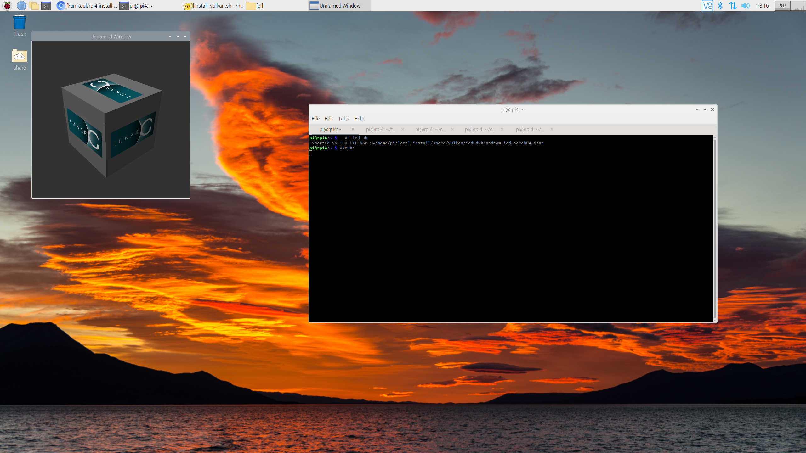

# Raspberry Pi 4 Mesa Vulkan Installer

Single shell script to install the [Mesa Vulkan driver for Raspberry Pi 4](https://gitlab.freedesktop.org/mesa/mesa.git).

_Tested on Linux rpi4 5.10.63-v8+ aarch64._



## Usage

1. Clone / copy / download script
2. Set as executable and run

### Installing Vulkan

Pass `--help` to print usage.

```bash
install_vulkan.sh [install[=~/mesa_vulkan]] [config[=release]] [src[=mesa]] 
	[build[=build/$config]] [script[=vk_icd.sh]]
```

1. `install`: where to install built Vulkan drivers
1. `config`: build configuration
1. `src`: where to clone the [mesa repository](https://gitlab.freedesktop.org/mesa/mesa.git)
1. `build`: where to build Vulkan drivers
1. `script`: name of source-able script to generate to set up an environment via installed drivers

### Using Vulkan

1. Source the generated script into the shell environment: `. vk_icd.sh`
1. Run `vkconfig` to confirm driver / loader / ICD / etc work as expected
1. Run desired Vulkan applications, eg `vkcube`
